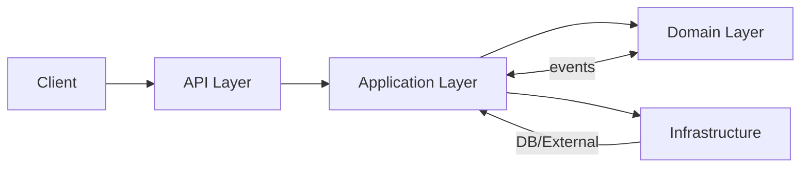
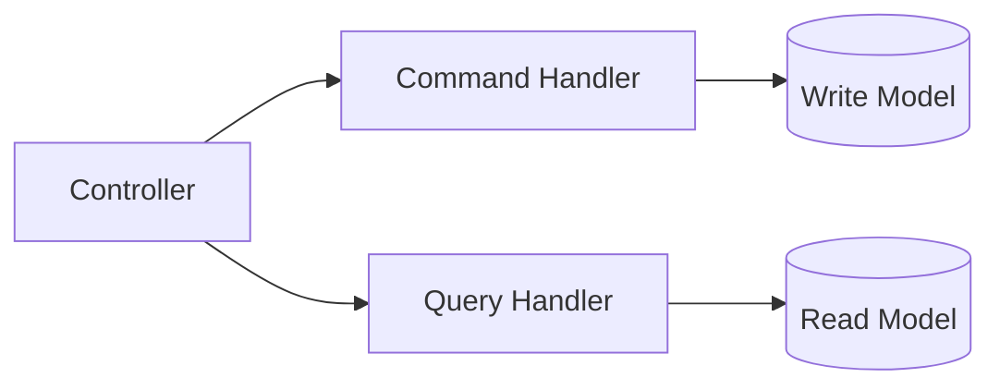
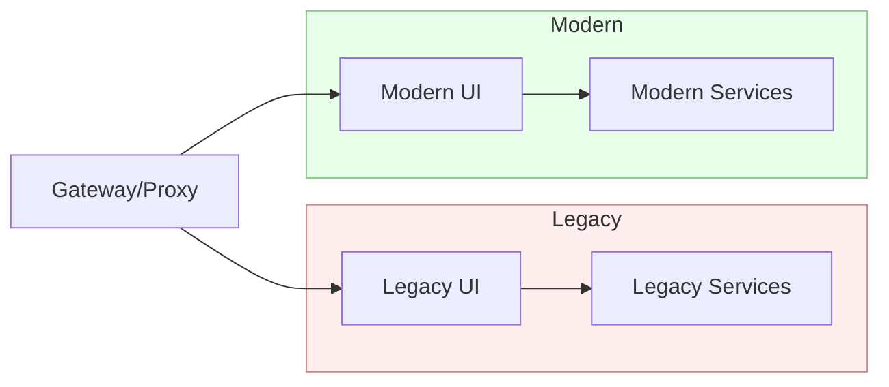
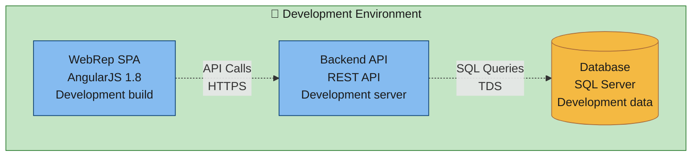
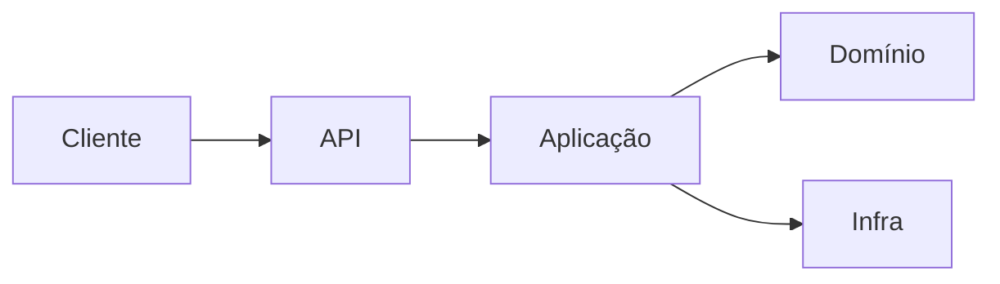
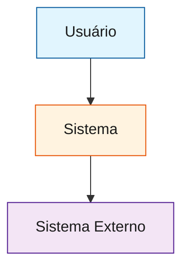
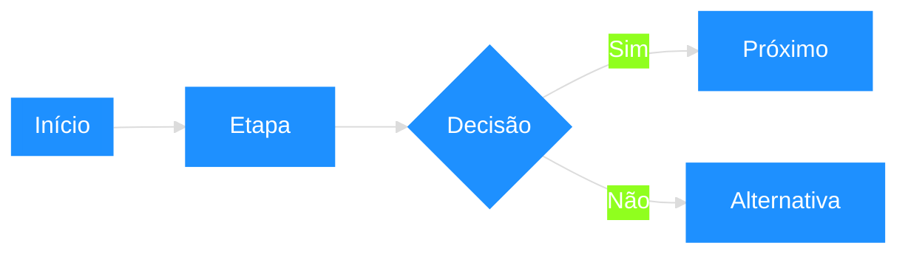

## Global Rules – Regras Gerais para Qualquer Projeto (versão detalhada)

### Sumário
- [1) Princípios Production‑First](#1-princípios-productionfirst-obrigatórios)
- [2) Qualidade de Código e Padrões](#2-qualidade-de-código-e-padrões)
- [3) Documentação (padrão)](#3-documentação-padrão)
- [4) Arquitetura e Organização](#4-arquitetura-e-organização)
- [5) Estratégias de Resolução](#5-estratégias-comprovadas-de-resolução-de-problemas)
- [6) Testes](#6-testes)
- [7) CI/CD e Deploy](#7-cicd-e-deploy)
- [8) Observabilidade](#8-observabilidade-logs-métricas-traces)
- [9) Segurança](#9-segurança-owasp-top-10--práticas)
- [10) Frontend](#10-frontend--padrões-gerais)
- [11) Modernização de Legacy](#11-modernização-de-legacy)
- [12) Resolução em Massa](#12-padrões-para-resolução-em-massa-alto-roi)
- [13) QA Playwright](#13-qa--padrões-de-e2e-visuais-playwright)
- [14) .NET/EF Core](#14-netef-core--regras-essenciais-opcional)
- [15) SLO/SLI/SLA e Orçamento de Erros](#15-sloslisl-e-orçamento-de-erros)
- [16) Gestão de Incidentes e Postmortem](#16-gestão-de-incidentes-e-postmortem)
- [17) Change Management e Feature Flags](#17-change-management-e-feature-flags)
- [18) Dados, Privacidade e LGPD/GDPR](#18-dados-privacidade-e-lgpdgdpr)
- [19) Design de APIs (REST/GraphQL)](#19-design-de-apis-restgraphql)
- [20) Performance e Caching](#20-performance-e-caching)
- [21) Segurança Avançada](#21-segurança-avançada)
- [22) Frontend – Seções Específicas](#22-frontend--seções-específicas)
- [23) Playwright Avançado (E2E Visual)](#23-playwright-avançado-e2e-visual)
- [24) Observabilidade – Dashboards e Alertas](#24-observabilidade--dashboards-e-alertas)
- [25) Kubernetes (produção)](#25-kubernetes-produção)
- [26) CI/CD Avançado](#26-cicd-avançado)
- [27) Governança de Repositório](#27-governança-de-repositório)
- [28) ROI, Riscos e Roadmap Técnico](#28-roi-riscos-e-roadmap-técnico)
- [29) Onboarding e Conhecimento](#29-onboarding-e-conhecimento)
- [30) Requisitos Não Funcionais (NFR) e Testes](#30-requisitos-não-funcionais-nfr-e-testes)
- [31) Débito Técnico e Triagem](#31-débito-técnico-e-triagem)
- [32) Multi‑Ambientes e Configuração](#32-multi-ambientes-e-configuração)
- [33) Banco de Dados e Migrações](#33-banco-de-dados-e-migrações)
- [34) Multi‑Tenancy (quando aplicável)](#34-multi-tenancy-quando-aplicável)
- [35) Chaos Engineering (opcional)](#35-chaos-engineering-opcional)
- [36) Internacionalização (i18n) e Localização (l10n)](#36-internacionalização-i18n-e-localização-l10n)
- [37) Segurança de Frontend](#37-segurança-de-frontend)
- [38) CORS e Headers de Segurança](#38-cors-e-headers-de-segurança)
- [39) ADR – Template](#39-adr--template)
- [40) Preservação de Identidade Visual (PIV) – Guia Definitivo](#40-preservação-de-identidade-visual-piv--guia-definitivo)
- [41) Modernização de Legado – Estratégia Completa](#41-modernização-de-legado--estratégia-completa)
- [42) Integrações Externas – Padrões de Resiliência](#42-integrações-externas--padrões-de-resiliência)
- [43) Storybook e Catálogo de Componentes (opcional, recomendado)](#43-storybook-e-catálogo-de-componentes-opcional-recomendado)
- [44) Fluxo de Handoff com Design (Figma)](#44-fluxo-de-handoff-com-design-figma)
- [45) Visual Regression Pipeline](#45-visual-regression-pipeline)
- [46) Performance Visual e UX](#46-performance-visual-e-ux)
- [47) Responsividade Fiel ao Legado](#47-responsividade-fiel-ao-legado)
- [48) Catálogo de Ícones e Ilustrações](#48-catálogo-de-ícones-e-ilustrações)
- [49) Gestão de Assets](#49-gestão-de-assets)
- [50) Template de Aprovação de Mudanças Visuais no PR](#50-template-de-aprovação-de-mudanças-visuais-no-pr)
- [51) Métricas de Preservação Visual](#51-métricas-de-preservação-visual)
- [52) Guia de Nomenclatura de Classes (BEM/Utilitários)](#52-guia-de-nomenclatura-de-classes-bemutilitários)
- [53) Revisões Periódicas de Marca](#53-revisões-periódicas-de-marca)
- [54) Estrutura de Pastas – Boas Práticas](#54-estrutura-de-pastas--boas-práticas)
- [55) SOLID – Aplicação Prática](#55-solid--aplicação-prática)
- [56) DDD – Diretrizes Objetivas](#56-ddd--diretrizes-objetivas)
- [57) CQRS – Padrão Pragmático](#57-cqrs--padrão-pragmático)
- [58) Clean Architecture – Contratos e Fluxo](#58-clean-architecture--contratos-e-fluxo)
- [59) Padrões de Projeto Relevantes](#59-padrões-de-projeto-relevantes)
- [60) Política de Repositórios (Sem Duplicações)](#60-política-de-repositórios-sem-duplicações)
- [61) Lições Aprendidas – Catálogo Resumido (com cross‑refs)](#61-lições-aprendidas--catálogo-resumido-com-crossrefs)
- [62) API Governance e Versionamento](#62-api-governance-e-versionamento)
- [63) Convenções de Commits, Branches e Releases](#63-convenções-de-commits-branches-e-releases)
- [64) Dados de Teste, Mascaramento e Síntese](#64-dados-de-teste-mascaramento-e-síntese)
- [65) Taxonomia de Erros e Correlação](#65-taxonomia-de-erros-e-correlação)
- [66) FinOps/Cloud Cost Management](#66-finopscloud-cost-management)
- [67) Backup/DR – Política e Testes](#67-backupdr--política-e-testes)
- [68) Regras de Interação (Chat/Agente)](#68-regras-de-interação-chatagente)
- [69) Data Governance e Lineage](#69-data-governance-e-lineage)
- [70) Telemetria de Produto](#70-telemetria-de-produto)
- [71) Dev Environment Padrão](#71-dev-environment-padrão)
- [72) Monorepo vs Polyrepo](#72-monorepo-vs-polyrepo)
- [73) Multi‑Região](#73-multi-região)
- [74) Mobile (se aplicável)](#74-mobile-se-aplicável)
- [75) AI/ML (se aplicável)](#75-aiml-se-aplicável)
- [76) Política de Licenças](#76-política-de-licenças)
- [77) Mermaid – Padrões de Uso](#77-mermaid--padrões-de-uso)

Nota global: Este documento é genérico e aplicável a qualquer projeto. Exemplos e termos específicos de stacks (ex.: .NET/EF Core, Playwright, React/Angular) são apresentados como apêndices opcionais. Adapte conforme seu contexto.

### 1) Princípios Production‑First (obrigatórios)

**Princípios orientadores fundamentais:**
- **Paridade funcional 100% (AS-IS) primeiro**: nenhuma evolução de jornada entra antes de migrar 100% do comportamento atual (funcionalidades, integrações e regras), mesmo com UI/arquitetura modernizadas. Não pode haver perda de capacidade para o usuário final.
- **Contratos claros e estáveis**: APIs e integrações evoluem por contrato (versionado), não por convenção implícita.
- **Qualidade como gate, não como atividade**: builds, testes e validações bloqueiam merge/deploy automaticamente.
- **Observabilidade e reversibilidade**: toda mudança é rastreável (logs/metrics/traces) e reversível (feature flags/rollbacks).
- **Simplicidade intencional**: evite soluções "clever"; priorize clareza, consistência e padronização.

1.1 Configuração por ambiente
- Variáveis de ambiente como fonte de verdade; zero secrets no repositório.
- Validação de configuração no startup (fail‑fast com mensagem clara).

Exemplos:
```ts
// Node/TS
function ensureEnv(name: string): string {
  const v = process.env[name];
  if (!v) throw new Error(`Missing env var ${name}`);
  return v;
}
export const config = {
  NODE_ENV: process.env.NODE_ENV ?? 'development',
  PORT: Number(process.env.PORT ?? 3000),
  DATABASE_URL: ensureEnv('DATABASE_URL'),
  LOG_LEVEL: process.env.LOG_LEVEL ?? 'info'
};
```
```csharp
// .NET
var builder = WebApplication.CreateBuilder(args);
string conn = builder.Configuration["ConnectionStrings:Default"]
  ?? throw new InvalidOperationException("Missing ConnectionStrings:Default");
```

1.2 Logging estruturado
- JSON, correlação (correlationId/requestId), níveis (`error`, `warn`, `info`, `debug`).
- Não vazar dados sensíveis nos logs.

```ts
// Winston
import winston from 'winston';
export const logger = winston.createLogger({
  level: process.env.LOG_LEVEL ?? 'info',
  format: winston.format.combine(
    winston.format.timestamp(),
    winston.format.errors({ stack: true }),
    winston.format.json()
  ),
  transports: [new winston.transports.Console()]
});
```

1.3 Health checks e readiness
- Endpoints `/health` (liveness), `/ready` (readiness) e `/live` quando aplicável.
- Readiness só true após dependências críticas (DB/cache) estarem OK.

1.4 Tratamento de erros
- Taxonomia clara (negócio vs técnica); Problem Details (HTTP APIs).
- Mensagens amigáveis ao cliente; detalhes técnicos nos logs apenas.

1.5 Resiliência: timeouts/retries/backoff/circuit breaker
- Timeouts sensatos (cliente e servidor). Retries com jitter exponencial para idempotentes.
- Circuit breaker para integrações instáveis.

1.6 Rate limiting e segurança transversal
- Rate limit por IP/rota/usuário. Headers de segurança, TLS obrigatório, CORS restritivo.

Checklist rápido (produção)
- [ ] Env validated on startup
- [ ] Logs estruturados + correlação
- [ ] Health/Ready/Live habilitados
- [ ] Timeouts + retries + circuit breaker
- [ ] Rate limiting + CORS + headers segurança
- [ ] Métricas/Traces + dashboards
- [ ] CI/CD com quality gates & scans

### 2) Qualidade de Código e Padrões
2.1 Tipagem e lint
- TypeScript `strict`; evitar `any` genérico; preferir unions/literais.
- ESLint/Prettier/netequivalentes com import/order e path aliases quando aplicável.

2.2 Nomenclatura e coesão
- Funções: verbos; variáveis: substantivos descritivos; componentes puros onde possível.
- Evitar comentários óbvios; documentar o “porquê”.

2.3 Zero simulações
- Evitar placeholders; implementar lógica real; valores configuráveis via env/feature flags.

2.4 Documentação mínima por mudança
- Atualizar README/ADR/guia de uso; diagramas quando houver mudanças arquiteturais.

### 3) Documentação (padrão)
- Documentação viva: README por módulo/feature, ADRs para decisões (ver Seção 37), diagramas atualizados (Mermaid). 
- Padrões resumidos:
  - README por módulo: objetivo, como rodar, dependências, endpoints/rotas, variáveis de ambiente, troubleshooting.
  - ADR curto (Seção 37): contexto → decisão → consequências; 1 ADR por decisão relevante.
  - Comentários de código: explicar “porquê”; evitar comentários óbvios.
  - Diagramas: manter simples e atualizados (fluxos principais e integrações).
  - Change log por release (resumo executivo: riscos, rollback, métricas de sucesso).

Modelos embutidos (inline):

Visual Approval – Checklist
```markdown
# Aprovação de Mudanças Visuais

## Checklist
- [ ] Capturas antes/depois anexadas
- [ ] Impacto em componentes reutilizados listado
- [ ] Aprovação do design/branding anexada
- [ ] Testes visuais passam (link do report)

## Descrição
Explique objetivo, escopo e impacto visual.
```

Gap Analysis – Template
```markdown
# Gap Analysis – {Módulo}

## Escopo
## Fluxos de negócio
## Regras e validações
## Integrações
## UI/Visual (capturas/links)
## Riscos e mitigação
## Plano de migração por fatias
## Métricas de sucesso
```

Migration Plan – Template
```markdown
# Migration Plan – {Módulo}

## Fase 1 (Discovery/ACL)
## Fase 2 (Shadow/Canary)
## Fase 3 (Cutover)
## Fase 4 (Decomission)
## Rollback Plan
## Owners e prazos
```

Tokens – Base (Sass)
```scss
:root {
  /* Brand */
  --brand-primary: #1E90FF;
  --brand-secondary: #FF7A59;
  /* Text */
  --text-primary: #222;  --text-secondary: #555;
  /* Surfaces */
  --surface-base: #fff;  --surface-muted: #f7f7f7;
  /* Border */
  --border-strong: #dcdcdc;
  /* Spacing */
  --space-4: 4px; --space-8: 8px; --space-12: 12px; --space-16: 16px; --space-24: 24px; --space-32: 32px; --space-48: 48px;
  /* Typography */
  --font-family-base: Inter, system-ui, -apple-system, Segoe UI, Roboto, Arial, sans-serif;
  --font-size-14: 14px; --font-size-16: 16px; --font-size-18: 18px;
  --line-height-140: 1.4; --line-height-150: 1.5;
  /* Radius & Shadows */
  --radius-4: 4px; --radius-8: 8px; --radius-12: 12px;
  --shadow-sm: 0 1px 2px rgba(0,0,0,.06);
  --shadow-md: 0 2px 8px rgba(0,0,0,.08);
  --shadow-lg: 0 6px 24px rgba(0,0,0,.12);
}
```

### 4) Arquitetura e Organização
- Modularidade por domínio/feature; dependências para interfaces/abstrações.
- DDD/CQRS quando houver ganho: entidades ricas, value objects, eventos; queries otimizadas.
- Separação de camadas (Domain/Application/Infra/API) em backends enterprise.
- Observabilidade cross‑cutting (logging, métricas, tracing) integrada desde o início.

### 5) Estratégias Comprovadas de Resolução de Problemas
4.1 Protocolos de segurança (mudanças massivas)
- Backup/checkpoint antes; validação incremental (lint/build/test) a cada passo.
- Limite de regressão: ≤ 10 novos erros; acima disso, rollback automático.

4.2 Análise de frequência e concentração
- Priorize top 3 tipos de erro por contagem; ataque arquivos com ≥ 3 ocorrências (efeito cascata).

4.3 Padrões de alto ROI (genéricos)
- Ordem de argumentos incorreta em construtores/métodos (corrige vários errors de conversão).
- Comparações com sentinelas incorretas (use `null`/`default` quando apropriado, não “mágicos”).
- Conversão de value objects → primitivos esperados (e.g., `.Value`/`.ToString()`/`.ToNumber()`).
- Eliminar duplicações de repositórios/contratos (interface + base concreta).

### 6) Testes
5.1 Pirâmide de testes
- Unit (rápidos, puros) > Integration (com DB/serviços reais) > E2E (fluxos críticos).

5.2 Contratos
- Testes de contrato (ex.: Pact/OpenAPI) em fronteiras entre serviços/frontend.

5.3 Dados determinísticos
- Seeds controlados/fixtures; evitar flaky (tempo/rede não determinísticos sem controle).

5.4 E2E mínimo
- Fluxos principais, captura de artefatos (screenshot/trace/vídeo), reporte HTML e thresholds de tolerância.

### 7) CI/CD e Deploy
6.1 Pipeline padrão (ex.: GitHub Actions)
- Jobs: lint → testes unit/integration → build → security scans (SCA/CodeQL) → e2e (opcional) → build artifacts → deploy.

Exemplo (resumo):
```yaml
name: CI
on: [push, pull_request]
jobs:
  lint_test:
    runs-on: ubuntu-latest
    steps:
      - uses: actions/checkout@v4
      - uses: actions/setup-node@v4
        with: { node-version: 20 }
      - run: npm ci
      - run: npm run lint && npm run test -- --coverage
  build:
    needs: lint_test
    runs-on: ubuntu-latest
    steps:
      - uses: actions/checkout@v4
      - run: npm ci && npm run build
```

6.2 Deploy
- Zero‑downtime (blue‑green/rolling), health checks e rollback automático.
- Infra como código (Docker/Kubernetes/Terraform) quando aplicável.

6.3 Quality Gates (Automáticos e Obrigatórios)
- **Princípio fundamental**: qualidade como gate, não como atividade. Builds, testes e validações bloqueiam merge/deploy automaticamente.
- **Gates obrigatórios que bloqueiam pipeline**:
  - Cobertura de testes ≥ 80% (unit) e ≥ 60% (integration)
  - Zero vulnerabilidades críticas/altas (SAST/SCA)
  - Complexidade ciclomática ≤ 10 por método
  - Performance: build time ≤ 10min, testes ≤ 5min
  - Lint/formatting: zero warnings em código novo
  - Testes de contrato passando (APIs)
  - Smoke tests em ambiente de staging
- **Políticas de exceção**: apenas com aprovação formal (change control) e plano de mitigação documentado.
- **Métricas de qualidade**: dashboards públicos com trends de cobertura, vulnerabilidades e tempo de build por equipe/repositório.

### 8) Observabilidade (Logs, Métricas, Traces)
7.1 Logs
- JSON; incluir metadata (serviço, versão, ambiente, correlationId, userId).

7.2 Métricas (RED/USE)
- RED: rate, errors, duration. USE: utilization, saturation, errors.
- Expor métricas para Prometheus.

7.3 Tracing distribuído
- OpenTelemetry: propagação de contexto, spans em operações críticas.

Exemplo Node/TS (traço básico):
```ts
import { trace, context } from '@opentelemetry/api';
const tracer = trace.getTracer('yourproject');
async function handleRequest() {
  const span = tracer.startSpan('operation');
  try { /* ... */ } finally { span.end(); }
}
```

### 9) Segurança (OWASP Top 10 + práticas)
- **Controle de acesso**: autorização por função/escopo; princípio do menor privilégio.
- **Criptografia**: TLS 1.2+; dados sensíveis em repouso (KMS/Vault); rotação de chaves.
- **Injeção**: ORMs/parametrização; nunca concatenar SQL; validação de inputs.
- **Configuração segura**: headers (CSP, HSTS, XFO, XSS), CORS restrito, cookies `HttpOnly/Secure`.
- **Componentes vulneráveis**: SCA em pipeline; CVEs críticos bloqueiam deploy.
- **Autenticação**: MFA/2FA quando aplicável; proteção contra brute force (rate limit/lockout).

Checklist segurança rápida
- [ ] Inputs saneados e validados
- [ ] Secrets fora do código (env/secret manager)
- [ ] TLS/headers/hardening aplicados
- [ ] Rate limit e detecção de abuso
- [ ] Scans automáticos (SCA/DAST) e correções

### 10) Frontend – Padrões Gerais
9.1 Arquitetura
- Rotas lazy; ErrorBoundary/Suspense (ou equivalentes) para quedas e carregamentos.
- Split por features; colocation de componentes/hooks/estilos.

9.2 Estado
- Hooks/signals/observables; memos para valores derivados; evitar duplicação de estado.

9.3 Formulários e validação
- RHF/Formik/etc + Zod/Yup; mensagens consistentes; máscaras quando necessário.

9.4 Acessibilidade (A11y)
- Semântica (landmarks/headings), `label/htmlFor`, foco visível, navegação por teclado, contrastes.

9.5 Performance
- Memoização criteriosa, virtualização (listas grandes), imagens otimizadas, code splitting.

9.6 Estilos
- Tokens (CSS vars), Sass modular, utilitários (`nx-stack-*`, `nx-row-*`), resets e temas via data‑attributes.

### 11) Modernização de Legacy
- **Inventário completo**: código, assets, integrações, jobs, configs, bancos.
- **Preservação de identidade visual/UX**; modernizar implementação técnica.
- **Estratégia incremental**: priorize alto valor/baixo risco; feature flags e paralelização.
- **KPIs de modernização**: dívida técnica, custo de manutenção, performance, segurança.

### 12) Padrões para Resolução em Massa (alto ROI)
- **Date/Time**: use `== default` para “não definido” em tipos não anuláveis; evite `.Value` indevido.
- **Conversões**: value objects → primitivos (ex.: `.ToString()`/`.Value`); decimal↔double com casts explícitos.
- **Construtores**: corrigir ordem de argumentos; alinhar com assinatura real.
- **Repos/contratos**: unificação sob interface/base comum para reduzir duplicações.
- **Protocolos de segurança**: backup/rollback, limite de regressão, validação incremental.

### 13) QA – Padrões de E2E Visuais (Playwright)
- **Config**: baseURL alinhado ao servidor local; `screenshot: only-on-failure`, `video/trace: retain-on-failure`.
- **Cenários mínimos**: rota raiz e rotas de demonstração; screenshots determinísticos (aguardar fontes/layout estável, fixar tema quando aplicável).
- **Artefatos**: salvar baselines/atuais em `tests-artifacts/`; `npx playwright show-report` para inspeção.

Exemplo mínimo `playwright.config.ts` (trecho):
```ts
use: {
  baseURL: process.env.BASE_URL ?? 'http://localhost:5173',
  screenshot: 'only-on-failure',
  video: 'retain-on-failure',
  trace: 'retain-on-failure'
}
```

---

## Apêndices Opcionais por Stack

### 14) .NET/EF Core – Regras Essenciais (opcional)
- **LINQ traduzível**: evite `ContainsKey`/indexer de dicionários em queries; materialize antes.
- **Expressões**: evite null‑propagation, method groups como bool, parâmetros opcionais em árvores de expressão.
- **Repos unificados**: `IRepository<TEntity, TKey>` + `BaseRepository<TEntity, TKey>`; evitar duplicações CRUD.
- **Paginados**: usar um `PagedResult<T>` canônico (assinatura consistente do construtor).
- **Conversões de ID**: quando integração expõe `long` e domínio usa `Guid`, padronizar extensão de conversão (ex.: `ToEventId()` em `Guid`) e evitar comparar tipos distintos.
- **Date/Time**: não usar `.Value` em tipos não anuláveis; para “não definido”, prefira `== default`.
- **decimal vs double**: operações matemáticas/estatísticas e `TimeSpan.From*` em `double` com cast explícito.

Exemplo de extensão (genérico):
```csharp
public static class GuidExtensions
{
    public static long ToEventId(this Guid guid)
    {
        var bytes = guid.ToByteArray();
        return BitConverter.ToInt64(bytes, 0);
    }
}
```

### B) QA – Playwright (E2E) (opcional)
- Projetos: Chromium/Firefox/WebKit; executar em headless/headed conforme necessidade.
- Determinismo: aguardar fontes/carregamento estável; setar `data-theme` quando necessário.

### C) Frontend – Padrões Gerais (opcional)
- Rotas lazy + boundaries; estado com hooks/signals; estilos com tokens e Sass modular.

### D) Modernização de Legacy (opcional)
- Estratégia incremental; preservar UX; KPIs e risk‑based planning.

---

## Fluxo Recomendado de Execução
1. **Planejar**: objetivos, métricas (ROI/KPIs), riscos, protocolos de segurança.
2. **Baseline**: lint, build, testes, segurança, performance.
3. **Aplicar mudanças curtas e seguras**: validação incremental + rollback quando necessário.
4. **Medir efeito cascata**: priorizar correções com maior impacto indireto.
5. **Documentar e automatizar**: ADRs, pipelines, dashboards, alertas.

## PR Checklist (genérico)
- [ ] Código limpo, tipado e formatado; imports organizados
- [ ] Testes (unit/integration/e2e) cobrindo mudanças e sem flaky
- [ ] Segurança: inputs saneados; secrets seguros; headers adequados
- [ ] Observabilidade: logs/metrics/traces para paths críticos
- [ ] A11y/Performance (frontend) validados
- [ ] Documentação (README/ADR/guia de uso) atualizada

## Notas de Uso
- Substitua/remova apêndices que não se apliquem ao seu stack.
- Mantenha os protocolos de segurança para mudanças massivas sempre ativos.
- Padronize terminologia e nomes (ex.: `YourProject`) conforme o seu contexto.

---

## 13) SLO/SLI/SLA e Orçamento de Erros
13.1 Definições
- **SLI** (Service Level Indicator): métrica observável (p.ex.: disponibilidade p99, latência p95).
- **SLO** (Service Level Objective): alvo para SLI (p.ex.: 99.9%/30d).
- **SLA** (Service Level Agreement): contrato externo com penalidades.
- **Error Budget**: 1 − SLO (p.ex.: SLO 99.9% → orçamento 0.1% indisponibilidade/30d).

13.2 Exemplo de configuração (YAML de referência)
```yaml
slos:
  - name: availability
    target: 0.999   # 99.9%
    window: 30d
    indicator: rate(http_requests_total{status=~"5.."}[5m])
  - name: latency_p95
    target: 0.95    # 95% das requests < 300ms
    window: 1h
    indicator: histogram_quantile(0.95, rate(http_request_duration_seconds_bucket[5m]))
alert_policies:
  - name: error_budget_burn
    condition: burn_rate > 2.0 over 1h
    action: page_on_call
```

13.3 Políticas de reação
- Burn rápido (1h): mitigar imediatamente (rollback/feature flag/k8s scale out).
- Burn lento (24h): planejar correção, criar task e priorizar.

## 14) Gestão de Incidentes e Postmortem
14.1 Fluxo de incidente
- Detectar → Triage (P1/P2/P3) → Mitigar (rollback/feature flag) → Restaurar serviço → Postmortem.

14.2 Postmortem sem culpa (blameless)
- Causas raízes (técnicas/processos); ações corretivas e preventivas; due‑date e owners.

Template curto:
```markdown
# Postmortem – Incidente {ID}
- Data/Hora: {UTC}
- Severidade: P1/P2/P3
- Impacto: {usuarios afetados, duração, regiões}
- Linha do tempo: {detecção→resolução}
- Causa raiz: {técnica/processo}
- Lições: {3–5 bullets}
- Ações: {lista com owner, prioridade e due-date}
```

## 15) Change Management e Feature Flags
15.1 Diretrizes
- Lançar em pequenos incrementos; dark‑launch; canary/gradual rollout.
- Flags por escopo (usuários/grupos/tenant/região), com expiração planejada.

15.2 Exemplo (pseudo‑código)
```ts
if (flags.isEnabled('new-checkout', { tenantId, region: 'SA' })) {
  return renderNewCheckout();
}
return renderLegacyCheckout();
```

## 16) Dados, Privacidade e LGPD/GDPR
16.1 Princípios
- Minimização, finalidade, consentimento, portabilidade e eliminação.
- PII/PHI: mascarar, criptografar em repouso/transporte; acesso auditável.

16.2 Diretrizes práticas
- Data retention policies por tipo de dado.
- Pseudonimização para ambientes de teste.
- Data Subject Requests (DSR): automação para export/delete.

## 17) Design de APIs (REST/GraphQL)
17.1 REST
- Recursos no plural; versionamento via path/headers; HATEOAS opcional.
- Erros: Problem Details (RFC 7807). Paginação, filtros, ordenação canônicos.

Exemplo de erro (Problem Details):
```json
{
  "type": "https://yourproject.dev/errors/validation",
  "title": "Invalid Request",
  "status": 400,
  "detail": "email is invalid",
  "instance": "/users"
}
```

17.2 GraphQL
- Schemas bem definidos; persisted queries; limites de profundidade/complexidade.

## 18) Performance e Caching
18.1 Back‑end
- Cache por chave (ex.: Redis); invalidação explícita; TTL sensato.
- Idempotência em endpoints com retries.

18.2 Front‑end
- Performance budgets (p.ex. LCP < 2.5s, JS < 200KB gz). Code‑split, prefetch, lazy.
- Imagens otimizadas (formatos modernos, tamanhos corretos, `loading="lazy"`).

18.3 CDN e Edge
- Headers de cache (`Cache-Control`, `ETag`); compressão (brotli/gzip); HTTP/2/3.

## 19) Segurança Avançada
19.1 Secrets Management
- Vault/KMS; rotação periódica; zero exposição em logs.

19.2 Threat Modeling
- STRIDE/LINDDUN conforme contexto; priorizar mitigação de alto risco.

19.3 Autenticação/Autorização
- JWT/OIDC; refresh tokens seguros; RBAC/ABAC; MFA para áreas críticas.

19.4 Proteções operacionais
- WAF, bot management, segurança de APIs (schema validation, rate limiting, mTLS quando aplicável).

## 20) Frontend – Seções Específicas
20.1 React
- Hooks: `useMemo/useCallback` parcimoniosos; `React.Suspense` com boundaries claras.
- Data fetching: React Query (staleTime, retry, invalidações explícitas); Error Boundary por página.

20.2 Angular
- Standalone components; signals para estado local/derivado; `@defer`/`@if`/`@for` (Angular 17+);
- Reactive forms + Zod/Yup; DI via `inject()`; módulos por feature.

20.3 UI/DS
- Tokens de design (cores, spacing, tipografia); utilitários de layout; responsividade e A11y obrigatórios.

## 21) Playwright Avançado (E2E Visual)
21.1 Estrutura
- Fixtures para login/setup; projetos por navegador; tags por suíte (smoke/regressão/visual).

21.2 Determinismo visual
- Aguardar fontes e layout estável; fixar `data-theme`; viewport padrão; mascarar flakiness (ex.: animações).

21.3 Exemplos
```ts
test('home visual', async ({ page }) => {
  await page.goto('/');
  await page.waitForLoadState('networkidle');
  await page.evaluate(() => document.documentElement.setAttribute('data-theme', 'light'));
  await page.waitForTimeout(50);
  expect(await page.screenshot()).toMatchSnapshot('home.png');
});
```

## 22) Observabilidade – Dashboards e Alertas
22.1 Dashboards
- Negócio (KPIs), Técnico (RED/USE), Infra (CPU/RAM/I/O), Erros (distribuição/heatmaps).

22.2 Alertas
- Multinível (info/warn/critical); evitar alert fatigue (agrupamento/janelas); runbooks.

## 23) Kubernetes (produção)
23.1 Manifests
- **HPA**: auto‑scaling por CPU/mem/latência; **PDB**: disponibilidade durante manutenções.
- **NetworkPolicy**: tráfego mínimo necessário; **Resource limits**: OOM/CPU throttling sob controle.

23.2 Exemplo PDB
```yaml
apiVersion: policy/v1
kind: PodDisruptionBudget
metadata:
  name: yourproject-pdb
spec:
  minAvailable: 2
  selector:
    matchLabels:
      app: yourproject-api
```

23.3 NetworkPolicy (exemplo simples)
```yaml
apiVersion: networking.k8s.io/v1
kind: NetworkPolicy
metadata:
  name: deny-all-except-gateway
spec:
  podSelector:
    matchLabels:
      app: yourproject-api
  policyTypes: [Ingress, Egress]
  ingress:
    - from:
        - namespaceSelector:
            matchLabels:
              name: ingress-nginx
  egress:
    - to:
        - namespaceSelector:
            matchLabels:
              name: database
```

## 24) CI/CD Avançado
24.1 Estratégias
- Blue‑green, canary, progressive delivery (Argo Rollouts/Flagger), gates de aprovação.

24.2 Segurança em pipelines
- Scans (SCA/SAST/DAST), assinaturas de artefatos, SBOM, supply‑chain (Sigstore/Cosign) quando aplicável.

## 25) Governança de Repositório
25.1 Codeowners e PR Template
- `CODEOWNERS` para áreas críticas; PR template com checklist e campos obrigatórios.

25.2 Políticas
- Branch protection; reviews obrigatórias; checks verificados; commits assinados.

Exemplo simples `CODEOWNERS`:
```text
docs/**     @team-docs
api/**      @backend-team
web/**      @frontend-team
```

## 26) ROI, Riscos e Roadmap Técnico
26.1 ROI e métricas
- Tempo economizado, redução de falhas, melhoria de performance, queda de custos cloud/licenças.

26.2 Riscos
- Técnicos (dívida, regressões, segurança), pessoas (bus factor), processo (release/rollback).

26.3 Roadmap
- Curto (0–1m): correções alto ROI; Médio (1–3m): otimizações; Longo (3–6m): iniciativas estratégicas.

## 27) Onboarding e Conhecimento
27.1 Onboarding
- Quickstart (setup, scripts, ambientes), visão geral de arquitetura, fluxos principais, como depurar.

27.2 Documentação viva
- ADRs curtos; docs por feature; gerações automáticas (OpenAPI/Storybook/Swaggers).

## 28) Requisitos Não Funcionais (NFR) e Testes
28.1 NFRs
- Disponibilidade, latência, throughput, segurança, privacidade, escalabilidade, custo.

28.2 Testes de NFR
- Perf/load (k6/JMeter), segurança (ZAP/Burp), caos (chaos‑mesh), DR (execuções mensais de recuperação).

## 29) Débito Técnico e Triagem
- Catálogo de débitos com impacto/complexidade; sprints com quota (ex.: 15%) dedicada a débitos.
- Rotina de tech review para reclassificar/fechar itens obsoletos.

## 30) Multi‑Ambientes e Configuração
- `dev`/`staging`/`prod` isolados; toggles por ambiente; migrações de banco versionadas.

## 31) Banco de Dados e Migrações
- Migrações idempotentes, rollback scripts, janelas de manutenção, índices planejados.
- Estratégias de evolução de schema (expand→migrate→contract) para zero‑downtime.

## 32) Multi‑Tenancy (quando aplicável)
- Isolamento lógico/físico; chaves de partição; limites por tenant; segregação de dados/recursos.

## 33) Chaos Engineering (opcional)
- Experimentos controlados (latência, falhas, interrupções); objetivos claros; rollback e aprendizado.

## 34) Internacionalização (i18n) e Localização (l10n)
- Catálogo de mensagens; plural rules; formatação cultural (data/número/moeda); textos acessíveis a screen readers.

## 35) Segurança de Frontend
- CSP estrita; evitar `dangerouslySetInnerHTML`; validação de dados antes de renderizar; sanitização de HTML.

## 36) CORS e Headers de Segurança
Exemplo Node/Express:
```ts
import helmet from 'helmet';
import cors from 'cors';
app.use(helmet({
  contentSecurityPolicy: {
    useDefaults: true,
    directives: { 'script-src': ["'self'", 'https://cdn.example.com'] }
  }
}));
app.use(cors({ origin: [/^https:\/\/app\.example\.com$/], credentials: true }));
```

## 37) ADR – Template
```markdown
# ADR {id}: {título curto}
- Data: {YYYY‑MM‑DD}
- Status: Proposta | Aprovada | Depreciada
- Contexto: {contexto do problema}
- Decisão: {o que foi decidido}
- Consequências: {prós/cons, trade‑offs}
- Alternativas consideradas: {opcional}
```

---

## Apêndice: Checklists Rápidos
### Deploy Production‑Ready
- [ ] Config por env validada
- [ ] Health/Ready/Live
- [ ] Logs estruturados + correlação
- [ ] Métricas RED/USE + tracing
- [ ] Rate limiting + headers + TLS
- [ ] CI/CD com gates + scans
- [ ] Rollback testado + backup

### Frontend PR
- [ ] A11y sem violações críticas
- [ ] Perf budgets atendidos
- [ ] Rotas lazy + boundaries
- [ ] Tokens CSS + responsividade
- [ ] Testes unit/integration/E2E

### Backend PR
- [ ] Endpoints idempotentes onde aplicável
- [ ] Erros no padrão Problem Details
- [ ] Regras de negócio cobertas por testes
- [ ] Observabilidade nas rotas críticas
- [ ] Segurança (authz/authn/inputs)

---

## Anexos Visuais – Diagramas (Mermaid)
Este anexo oferece diagramas de referência para fluxos citados nas seções (Clean Architecture, CQRS e Strangler Fig).

### Clean Architecture (ref. Seção 55)


### CQRS (ref. Seção 54)


### Strangler Fig – Modernização de Legado (ref. Seção 39)


---

## Anexo – Snippets de Rotas (React e Angular)

### React Router v6 – Rotas Lazy + Providers
```tsx
// src/routes/index.tsx
import { Suspense, lazy } from 'react';
import { createBrowserRouter, RouterProvider } from 'react-router-dom';

const Home = lazy(() => import('@pages/Home'));
const Users = lazy(() => import('@pages/Users'));

const router = createBrowserRouter([
  { path: '/', element: <Home /> },
  { path: '/users', element: <Users /> }
]);

export function AppRouter() {
  return (
    <Suspense fallback={<div>Carregando…</div>}>
      <RouterProvider router={router} />
    </Suspense>
  );
}
```
```tsx
// src/main.tsx
import React from 'react';
import ReactDOM from 'react-dom/client';
import { QueryClient, QueryClientProvider } from '@tanstack/react-query';
import { AppRouter } from '@routes/index';

const qc = new QueryClient({
  defaultOptions: {
    queries: { retry: 1, refetchOnWindowFocus: false, staleTime: 60_000 }
  }
});

ReactDOM.createRoot(document.getElementById('root')!).render(
  <React.StrictMode>
    <QueryClientProvider client={qc}>
      <AppRouter />
    </QueryClientProvider>
  </React.StrictMode>
);
```

### Angular – Rotas Standalone + Providers
```ts
// src/app/app.routes.ts
import { Routes } from '@angular/router';

export const routes: Routes = [
  { path: '', loadComponent: () => import('./features/home/home.page').then(m => m.HomePage) },
  { path: 'users', loadComponent: () => import('./features/users/users.page').then(m => m.UsersPage) }
];
```
```ts
// src/app/app.config.ts
import { ApplicationConfig } from '@angular/core';
import { provideRouter } from '@angular/router';
import { routes } from './app.routes';

export const appConfig: ApplicationConfig = {
  providers: [
    provideRouter(routes)
    // provideHttpClient(), interceptors, etc.
  ]
};
```

---

## 38) Preservação de Identidade Visual (PIV) – Guia Definitivo
Objetivo: migrar/modernizar sem alterar a percepção de marca e experiência visual dos usuários. A modernização técnica não pode “inventar” visual novo sem aprovação do branding.

38.1 Princípios
- Preserve: logotipos, paleta de cores, tipografia, ícones, espaçamentos, composição geral.
- Não recrie: assets originais (logos, ilustrações, imagens de marca). Use os arquivos oficiais.
- Fidelidade: componentes e páginas devem manter hierarquia visual e affordances originais.
- Acessibilidade: elevar contraste e legibilidade sem descaracterizar a marca (apenas correções necessárias para WCAG AA/AAA).

38.2 Inventário e Auditoria Visual (obrigatório)
- Assets: logos (todas variações), ícones, ilustrações, favicons, splash screens.
- Tipografia: famílias, pesos, tamanhos, line-height e letter-spacing.
- Cores: paletas, usos semânticos, estados (hover/focus/active/disabled), variações de tema (light/dark).
- Layout: grid, gutters, breakpoints, espaçamentos (margens/paddings), densidade.
- Componentes: botões, inputs, cards, tabelas, modais, navegação, breadcrumbs.

Template de inventário (CSV/Markdown):
```markdown
| Tipo     | Nome/ID                 | Caminho/Ref               | Observações |
|---------|--------------------------|---------------------------|-------------|
| Logo    | logotipo principal       | public/logo-primary.svg   | SVG, não rasterizar |
| Fonte   | Inter Regular 400        | assets/fonts/inter.woff2  | preload em head |
| Cor     | Brand Primary            | #1E90FF                   | token: --brand-primary |
| Ícone   | ícone de busca           | icons/search.svg          | 16/20/24 px |
| Layout  | Grid base                | 12 col, 24px gutter       | breakpoints xs/sm/md/lg/xl |
```

38.3 Tokens e Nomenclatura Canônica
- Cores: `--brand-primary`, `--brand-secondary`, `--text-primary`, `--surface-elevated`, `--border-strong`.
- Espaçamentos: `--space-4/8/12/16/24/32/48` (px) ou escala 4‑base.
- Tipografia: `--font-family-base`, `--font-size-14/16/18`, `--line-height-140`.
- Raio/Sombra: `--radius-4/8/12`, `--shadow-sm/md/lg`.

Exemplo (tokens.scss):
```scss
:root {
  --brand-primary: #1E90FF;
  --brand-secondary: #FF7A59;
  --text-primary: #222;
  --text-secondary: #555;
  --surface-base: #fff;
  --surface-muted: #f7f7f7;
  --border-strong: #dcdcdc;

  --space-4: 4px;  --space-8: 8px;  --space-12: 12px;  --space-16: 16px;
  --space-24: 24px; --space-32: 32px; --space-48: 48px;

  --font-family-base: Inter, system-ui, -apple-system, Segoe UI, Roboto, Arial, sans-serif;
  --font-size-14: 14px; --font-size-16: 16px; --font-size-18: 18px;
  --line-height-140: 1.4; --line-height-150: 1.5;

  --radius-4: 4px; --radius-8: 8px; --radius-12: 12px;
  --shadow-sm: 0 1px 2px rgba(0,0,0,.06);
  --shadow-md: 0 2px 8px rgba(0,0,0,.08);
  --shadow-lg: 0 6px 24px rgba(0,0,0,.12);
}
```

38.4 Tipografia e Performance
- Formatos: WOFF2 preferencial; preloads no `<head>` para fontes críticas.
- FOIT/FOUT: `font-display: swap;` ou `optional` conforme diretriz de UX.
- Escala tipográfica: defina uma escala base e aplique consistentemente (H1..H6, body, caption).

Exemplo (typography.scss):
```scss
@font-face {
  font-family: 'Inter';
  src: url('/assets/fonts/inter.woff2') format('woff2');
  font-weight: 400 700;
  font-style: normal;
  font-display: swap;
}

.nx-text-body { font: 400 var(--font-size-16)/var(--line-height-150) var(--font-family-base); }
.nx-text-caption { font: 400 var(--font-size-14)/var(--line-height-140) var(--font-family-base); }
.nx-heading-1 { font: 700 28px/1.3 var(--font-family-base); letter-spacing: -.01em; }
```

38.5 Layout e Grid
- Grid fluido com gutters originais; breakpoints equivalentes aos do legado.
- Tabelas e denso de dados: preservar densidade (altura de linha, padding de células) e contraste.

Exemplo (grid):
```scss
.nx-grid {
  display: grid;
  grid-template-columns: repeat(12, 1fr);
  gap: 24px; /* preservar gutter original */
}
.nx-col-6 { grid-column: span 6; }
@media (max-width: 1024px) { .nx-col-6 { grid-column: span 12; } }
```

38.6 CSS Migration – Anticorruption Layer (ACL CSS)
- Mapeie classes antigas para utilitários modernos sem reescrever telas de imediato.
```scss
/* legacy → moderno */
.btn-primary { @extend .app-btn; background: var(--brand-primary); }
.panel { background: var(--surface-base); box-shadow: var(--shadow-sm); border-radius: var(--radius-8); }
```

38.7 Diferença Visual e QA
- Ferramentas: Playwright/Cypress visual, `pixelmatch`, `reg-suit`.
- Processo: screenshots baseline/atual; tolerância de diffs; aprovação de branding antes do merge.

Check de paridade visual:
- [ ] Layout (grid, gutters, hierarquia) igual ao legado
- [ ] Tipografia (família/peso/tamanho/altura de linha)
- [ ] Cores e estados (hover/focus/disabled/active)
- [ ] Espaçamentos e densidade
- [ ] Ícones e alinhamentos

38.8 Theming e Dark Mode
- `data-theme="light|dark"` no `<html>`; tokens específicos por tema.
```scss
[data-theme='dark'] {
  --surface-base: #121212; --text-primary: #ececec; --border-strong: #2a2a2a;
}
```

38.9 Ícones e SVGs
- Use SVGs otimizados (SVGO); `currentColor` para herdar a cor do texto, quando apropriado.
- Sprites SVG para ícones maiores em listas/tabelas.

38.10 Responsividade e Breakpoints
- Documentar breakpoints originais; validar de mobile a desktop mantendo o layout do legado.

38.11 A11y + Identidade
- Ajustar contraste quando necessário (sem descaracterizar); foco visível e consistente.

38.12 Processo de Aprovação de Marca
- Checklist e fluxo de aprovação por “Brand Guardians”.
- Gate no CI para PRs que alterem tokens/estilos base exigirem aprovação do time de design.

---

## 39) Modernização de Legado – Estratégia Completa
Missão: migrar do legado para arquitetura moderna preservando identidade visual, reduzindo risco e melhorando ROI.

39.1 Fases (Strangler Fig)
1. Discovery & Inventory: mapear módulos, integrações, jobs, dados, assets, regras de negócio.
2. Anticorruption Layer (ACL): encapsular o legado; isolar nomenclatura/formatos antigos.
3. Roteamento/Proxy: desviar rotas específicas para o novo serviço/página conforme migração.
4. Feature Flags e Shadow Traffic: liberar para pilotos; rodar em paralelo (ler do novo, escrever no antigo, ou dual‑write controlado).
5. Faseamento: migrar por fatias (vertical slice) e domínio (ex.: autenticação → perfil → catálogo → pedidos).
6. Decomissionamento controlado: desligar componentes legados com métricas de adoção e erro zero.

39.2 Critérios de Priorização
- Impacto no usuário, risco, complexidade, dependências, valor de negócio.
- ROI: custos evitados do legado (licenças, operações), performance/UX melhorada, produtividade.

39.3 Anticorruption Layer (exemplos)
- API Gateway traduzindo contratos: legado → moderno (renomear campos, normalizar enums, conversões de data/ID).
- Mappers entre DTOs legados e modelos modernos (ex.: `LegacyUserDto → User`).
- Camada de compatibilidade CSS (ACL CSS) para preservar visual enquanto moderniza internals.

39.4 Dados e Migrações
- Expand–Migrate–Contract: adicionar colunas/tabelas (expand), popular/validar (migrate), remover antigas (contract).
- Estratégias: dual‑write, shadow write, CDC (Change Data Capture), janelas de corte, migração incremental.
- Plano de rollback e consistência (checksums, contagens, auditoria).

39.5 Integrações Externas
- Catalogar endpoints, chaves, SLAs; criar mocks contratuais para testes; timeouts/retries;
- Gradual cut‑over com canary de requisições.

39.6 Segurança e Compliance no Legado
- Mapear dados sensíveis; criptografar em repouso; mascarar PII em logs; revisar permissões.

39.7 Métricas de Sucesso
- Disponibilidade, latência, taxa de erro, adoção (usuários migrados), tickets de suporte, satisfação.
- Financeiro: redução de custos (infra/licenças), tempo de entrega (lead time), MTTR.

39.8 Design/Frontend na Modernização (com PIV)
- Preservar tokens originais; converter CSS legado em tokens Sass sem alterar visual.
- Refatorar componentes gradualmente: extrair “shell” visual idêntico; modernizar lógica por dentro.

39.9 Estratégia para Componentes Monolíticos
- Extrair modelos (`models/`), serviços (`services/`), e orquestração (`component.tsx/.ts`)
- Migrar bindings legacy (ex.: two‑way) para estado moderno (hooks/signals), mantendo markup/classes originais.

39.10 Playbook de Migração (resumo)
1) Selecionar módulo de alto ROI/baixo risco.
2) Criar ACL e proxies necessários.
3) Replicar layout/visual 1:1 (tokens, grid, tipografia).
4) Migrar lógica crítica; testar com shadow users.
5) Ativar canary por %/tenant/timebox.
6) Medir; corrigir; aumentar cobertura; desligar legado.

39.11 Templates
Template Gap Analysis (MD):
```markdown
## Gap Analysis – {Módulo}
### Escopo
### Fluxos de negócio
### Regras e validações
### Integrações
### UI/Visual (capturas/links)
### Riscos e mitigação
### Plano de migração por fatias
### Métricas de sucesso
```

Template Migration Plan (MD):
```markdown
## Migration Plan – {Módulo}
### Fase 1 (Discovery/ACL)
### Fase 2 (Shadow/Canary)
### Fase 3 (Cutover)
### Fase 4 (Decomission)
### Rollback Plan
### Owners e prazos
```

39.12 Riscos Típicos e Mitigações
- Regressão visual: usar testes visuais; gates de branding; aprovações explícitas.
- Inconsistência de dados: dual‑write com reconciliação e monitoramento; fallback para leitura do legado.
- Débitos persistentes: limite de tempo para ACL; registrar tarefas de remoção.

39.13 Comunicação e Gestão de Stakeholders
- Roadmap e status públicos; vitrine de migração (dash de módulos migrados); ISO de decisões (ADRs).

39.14 Ferramentas Sugeridas
- Gateway/Proxy (NGINX/YARP), Mappers (MapStruct/AutoMapper), CDC (Debezium), Visuais (Storybook/Chromatic), Playwright/Cypress Visual, Análise de UX (Hotjar/FullStory) quando permitido.

39.15 Governança da Migração
- **Inventário de jornadas legadas**: mantenha um catálogo de rotas/telas/funcionalidades e seu mapeamento no moderno (matriz FE↔BE↔Integrações).
- **Definição de Pronto (DoD) para migração**:
  - Tela moderna equivalente funcionando (FE).
  - Endpoints modernos cobrindo o escopo e casos de erro (BE).
  - Integrações externas ligadas e resilientes (retries/circuit breaker/timeouts).
  - Autorização, auditoria e telemetria ativas.
  - Testes (unit/integration/e2e/smoke) passando.
  - Documentação atualizada (contratos, runbooks e mapeamento legado→moderno).
- **Política "paridade antes de features" (100%)**: novas features só após 100% de paridade por domínio. Qualquer exceção exige aprovação formal (change control), plano de mitigação e comunicação aos usuários.
  - **Regra de ouro (AS-IS 100%)**: evoluir layout/tecnologia é permitido, mas o comportamento e a cobertura funcional devem permanecer idênticos ao estado atual até que a paridade seja comprovada por testes e validações.
- **Sem "stubs" permanentes**: qualquer stub deve ter owner, prazo e tarefa vinculada; builds falham se prazos expiram.

39.16 Checklists Operacionais
- **Pré-migração**: inventário da jornada, contratos validados, dependências mapeadas, riscos e plano de reversão.
- **Por jornada**: paridade funcional verificada, testes cobrindo fluxos principais, documentação e telemetria ok.
- **Integração nova**: contrato versionado, credenciais seguras, testes de resiliência e limites de uso.
- **EF Core**: chaves definidas, VO conversions explícitas, navegações e FKs revisadas, migrações geradas.
- **API change**: versionamento, compatibilidade retroativa, documentação e consumidores notificados.
- **UI change**: acessibilidade e responsividade validadas, rota coberta, fallback/empty states.

39.17 Métricas Mínimas de Sucesso
- 100% de jornadas críticas com paridade funcional e observabilidade.
- 0 colisões de rotas/Swagger e 0 stubs sem prazo.
- Taxa de sucesso de integrações dentro do SLA e MTTR reduzido por playbooks.

---

## 40) Integrações Externas – Padrões de Resiliência

40.1 Catálogo de Integrações
- **Inventário obrigatório**: para cada sistema externo, registre propósitos, contratos (OpenAPI/protobuf), SLAs, autenticação, limites de uso e contatos técnicos.
- **Matriz de dependências**: mapeie criticidade (crítica/importante/opcional) e impacto de indisponibilidade por jornada de usuário.
- **Ambientes segregados**: endpoints e credenciais distintos por ambiente; dados de teste nunca vão para produção.

40.2 Contrato-First e Versionamento
- **Contratos versionados**: OpenAPI/protobuf/JSON Schema como fonte da verdade; mudanças breaking exigem nova versão.
- **Compatibilidade retroativa**: mantenha versões antigas funcionais por período acordado (ex.: 6 meses).
- **Documentação viva**: contratos atualizados automaticamente; exemplos de request/response; códigos de erro documentados.

40.3 Resiliência Obrigatória
- **Timeouts configuráveis**: por operação (ex.: 5s para consultas, 30s para processamento); nunca infinitos.
- **Retries com backoff**: exponential backoff com jitter; máximo de 3 tentativas; idempotência garantida.
- **Circuit breaker**: abrir após N falhas consecutivas; half-open para testar recuperação; métricas de estado.
- **Fallbacks**: comportamento degradado quando integração falha (cache, dados padrão, fila para retry posterior).

40.4 Segurança e Credenciais
- **Secrets em cofre**: Azure Key Vault/AWS Secrets Manager/HashiCorp Vault; rotação automática quando possível.
- **Princípio do menor privilégio**: credenciais com escopo mínimo necessário; revisão periódica de permissões.
- **Auditoria**: log de tentativas de acesso (sucesso/falha) com correlationId; alertas para padrões suspeitos.

40.5 Observabilidade de Integrações
- **Métricas RED**: Rate (req/s), Errors (%), Duration (latência p50/p95/p99) por endpoint externo.
- **Health checks**: verificação periódica de conectividade; status dashboard; alertas proativos.
- **Distributed tracing**: propagação de contexto; spans para cada chamada externa; correlação de erros.

40.6 Testes de Resiliência
- **Testes de contrato**: validação automática de schemas; detecção de breaking changes.
- **Chaos testing**: simulação de falhas (timeout, 5xx, network partition); validação de fallbacks.
- **Load testing**: verificação de limites de rate; comportamento sob stress.

40.7 Padrões de Implementação (.NET)
```csharp
// HttpClient com políticas de resiliência
services.AddHttpClient<ExternalApiClient>(client =>
{
    client.BaseAddress = new Uri(config.ExternalApiUrl);
    client.Timeout = TimeSpan.FromSeconds(30);
})
.AddPolicyHandler(GetRetryPolicy())
.AddPolicyHandler(GetCircuitBreakerPolicy());

static IAsyncPolicy<HttpResponseMessage> GetRetryPolicy()
{
    return Policy
        .HandleResult<HttpResponseMessage>(r => !r.IsSuccessStatusCode)
        .WaitAndRetryAsync(
            retryCount: 3,
            sleepDurationProvider: retryAttempt => 
                TimeSpan.FromSeconds(Math.Pow(2, retryAttempt)) + 
                TimeSpan.FromMilliseconds(Random.Shared.Next(0, 1000)));
}
```

40.8 Checklist de Integração Nova
- [ ] Contrato versionado e documentado
- [ ] Credenciais seguras e com escopo mínimo
- [ ] Timeouts, retries e circuit breaker configurados
- [ ] Fallbacks e comportamento degradado definidos
- [ ] Testes de contrato e resiliência implementados
- [ ] Métricas e alertas configurados
- [ ] Documentação de troubleshooting e runbooks

---

## 41) Storybook e Catálogo de Componentes (opcional, recomendado)
- Catálogo vivo; docs MDX with examples; snapshots de props e variações.
- Integração com tokens (via CSS variables, theme providers).
- Testes visuais automatizados no PR.

## 41) Fluxo de Handoff com Design (Figma)
- Fonte da verdade do design; tokens exportáveis; checklist de variações.
- Proceder com “Design QA” antes de merge em páginas críticas.

## 42) Visual Regression Pipeline
- Jobs noturnos comparando telas críticas; alertas se delta > tolerância.
- Storage de baselines por branch/release.

## 43) Performance Visual e UX
- Orçamento para CLS/LCP/INP; lazy/priority hints; skeletons consistentes com o legado.

## 44) Responsividade Fiel ao Legado
- Não “quebrar” grids originais; apenas corrigir bugs de overflow/conteúdo dinâmico.

## 45) Catálogo de Ícones e Ilustrações
- Sprite/pack; naming consistente; guia de tamanhos; fallback para fontes de ícones legadas (se inevitável).

## 46) Gestão de Assets
- Estrutura: `public/` (imagens estáticas), `assets/` (build), `icons/` (SVG limpos), `fonts/`.
- Estratégias de cache e versionamento (hash nos nomes).

## 47) Template de Aprovação de Mudanças Visuais no PR
```markdown
### Visual Changes
- [ ] Capturas antes/depois anexadas
- [ ] Impacto em componentes reutilizados listado
- [ ] Aprovação do design/branding anexada
- [ ] Testes visuais passam (link para report)
```

## 48) Métricas de Preservação Visual
- % de telas com paridade 1:1; nº de regressões; tempo médio de correção; satisfação de stakeholders.

## 49) Guia de Nomenclatura de Classes (BEM/Utilitários)
- `.nx-` prefix para utilitários; BEM para componentes (`.card`, `.card__title`, `.card--elevated`).

## 50) Revisões Periódicas de Marca
- Auditoria trimestral: consistência de tokens, fontes, cores; alinhamento com manual de marca.

---

## 51) Estrutura de Pastas – Boas Práticas
51.1 Projetos Web SPA (pequenos/médios)
```text
src/
  assets/         # imagens, ícones, fontes
  styles/         # Sass/CSS modularizado (tokens, base, components)
  ui/             # componentes UI reutilizáveis (headless + wrappers)
  pages/          # páginas/rotas da aplicação
  components/     # componentes específicos (colocation quando fizer sentido)
  hooks/          # hooks customizados
  services/       # clientes de API, integrações externas
  context/        # providers de estado global leve
  utils/          # utilitários puros
  data/           # constantes, mocks determinísticos
```

51.2 Backends (Clean Architecture)
```text
src/
  Domain/           # Entidades, Value Objects, Eventos, Regras (DDD puro)
  Application/      # Casos de uso (CQRS: Commands/Queries + Handlers), DTOs, Validadores
  Infrastructure/   # EF Core, Repositórios, Integrations, Configuração
  Api/              # Controllers/Endpoints, Middleware, DI Composition Root
```

51.3 Guidelines
- Colocation: código que muda junto, fica junto.
- Nomes descritivos, evitar “misc/utils” genéricos; pastas devem comunicar propósito.
- Exposição estável por `index.ts`/`index.cs` para evitar imports frágeis.

51.4 React (Vite/TypeScript)
```text
src/
  assets/           # imagens, ícones, fontes
  styles/           # tokens.scss, base.scss, components.scss, index.scss
  ui/               # componentes UI reutilizáveis (headless + wrappers)
  components/       # componentes específicos de páginas ou compartilhados pequenos
  pages/            # rotas/páginas
  hooks/            # hooks customizados
  context/          # providers de estado global leve
  services/         # API clients (fetch/axios), caches locais
  utils/            # funções puras utilitárias
  data/             # constantes, mocks determinísticos
  routes/           # (opcional) configuração de rotas centralizadas
  main.tsx          # providers (Router, QueryClient, Theme)
  App.tsx
```

Aliases (tsconfig + Vite):
```json
// tsconfig.app.json
{
  "compilerOptions": {
    "baseUrl": ".",
    "paths": {
      "@ui/*": ["src/ui/*"],
      "@pages/*": ["src/pages/*"],
      "@styles/*": ["src/styles/*"],
      "@assets/*": ["src/assets/*"],
      "@shared/*": ["src/components/*"],
      "@context/*": ["src/context/*"],
      "@services/*": ["src/services/*"],
      "@utils/*": ["src/utils/*"],
      "@data/*": ["src/data/*"]
    }
  }
}
```
```ts
// vite.config.ts
import path from 'node:path';
export default {
  resolve: {
    alias: {
      '@ui': path.resolve(process.cwd(), 'src/ui'),
      '@pages': path.resolve(process.cwd(), 'src/pages'),
      '@styles': path.resolve(process.cwd(), 'src/styles'),
      '@assets': path.resolve(process.cwd(), 'src/assets'),
      '@services': path.resolve(process.cwd(), 'src/services'),
      '@utils': path.resolve(process.cwd(), 'src/utils')
    }
  }
};
```

51.5 Angular (Standalone + Signals)
```text
src/
  app/
    core/            # serviços cross-cutting (interceptors, guards, config)
    shared/          # componentes/ui/pipes/diretivas reutilizáveis
      components/
      ui/
      pipes/
      directives/
    features/
      feature-a/
        pages/       # páginas standalone da feature
        components/  # componentes internos da feature
        services/    # serviços da feature (HTTP, estado)
        store/       # signals/estado local da feature
        routes.ts    # rotas lazy da feature
        index.ts
    app.config.ts    # bootstrap + providers
  assets/
  styles/            # tokens.scss, base.scss, components.scss, index.scss
  environments/      # variáveis de ambiente (build‑time)
```

Diretrizes Angular:
- Standalone components; rotas lazy por feature; `inject()` em vez de constructors pesados.
- Estado local com signals/computed; evitar serviços globais sem necessidade.
- Formulários reativos + validação (Zod/Yup opcional); interceptors para auth/errors.

Aliases (tsconfig):
```json
{
  "compilerOptions": {
    "baseUrl": ".",
    "paths": {
      "@app/*": ["src/app/*"],
      "@assets/*": ["src/assets/*"],
      "@styles/*": ["src/styles/*"],
      "@shared/*": ["src/app/shared/*"],
      "@core/*": ["src/app/core/*"],
      "@features/*": ["src/app/features/*"]
    }
  }
}
```


## 52) SOLID – Aplicação Prática
- S (Single Responsibility): classes e módulos com uma única razão para mudar.
- O (Open/Closed): abertos para extensão, fechados para modificação (ex.: estratégias/handlers).
- L (Liskov Substitution): contratos respeitados; evitar exceções inesperadas em implementações.
- I (Interface Segregation): interfaces pequenas e específicas; evitar “god interfaces”.
- D (Dependency Inversion): depender de abstrações, não concretos; inversion of control via DI.

Exemplo (DIP no backend):
```csharp
public interface IEmailSender { Task SendAsync(Message m, CancellationToken ct); }
public class SmtpEmailSender : IEmailSender { /* ... */ }
public class NotifyUserHandler {
  private readonly IEmailSender _sender;
  public NotifyUserHandler(IEmailSender sender) { _sender = sender; }
}
```

## 53) DDD – Diretrizes Objetivas
53.1 Ubiquitous Language
- Glossário do domínio compartilhado; nomes refletindo a linguagem do negócio.

53.2 Entidades e Value Objects
- Entidades com identidade e ciclo de vida; VOs imutáveis com igualdade estrutural.

53.3 Agregados e Invariantes
- Definir raízes de agregado; manter invariantes dentro dos limites do agregado.

53.4 Eventos de Domínio
- Comunicar mudanças significativas do domínio; handlers para side effects.

53.5 Bounded Contexts
- Mapear contextos; ACL entre contextos; contratos e integrações explícitos.

## 54) CQRS – Padrão Pragmático
54.1 Quando usar
- Leitura e escrita com requisitos distintos, queries ricas/performance, side effects de negócio.

54.2 Estrutura
```text
Application/
  Commands/           # Mutations de estado
  Queries/            # Leituras/relatórios
  Handlers/           # Implementações
  Validators/         # Regras de entrada
  DTOs/               # Modelos de I/O
```

54.3 Boas práticas
- Idempotência em comandos sensíveis; retries seguros; compensações quando necessário.
- Queries otimizadas (projeções), sem regras de negócio complexas.

## 55) Clean Architecture – Contratos e Fluxo
55.1 Regras
- Domain sem dependências externas; Application depende apenas de Domain; Infra/Api dependem de Application.

55.2 Fluxo típico
```text
Request → Api (Controller) → Application (Command/Query) → Domain (regras) → Infra (persistência) → Response
```

55.3 Benefícios
- Testabilidade, isolamento de detalhes técnicos, evolução guiada por domínio.

## 56) Padrões de Projeto Relevantes
- Strategy, Factory, Specification, Mediator (MediatR), Repository, Unit of Work.
- Circuit Breaker/Retry/Timeout (resiliência), Adapter/Facade (integrações), Mapper (DTO↔Domínio).

## 57) Política de Repositórios (Sem Duplicações)
- Interfaces no domínio (ex.: `IRepository<TEntity, TKey>`);
- Implementações concretas herdando de `BaseRepository` na infraestrutura;
- Apenas métodos específicos nos repositórios concretos; CRUD padrão no base.

---

## 58) Lições Aprendidas – Catálogo Resumido (com cross‑refs)
Objetivo: preservar, em nível executivo, as lições com maior ROI e onde aplicá‑las no documento.

- Protocolos de Segurança para Mudanças Massivas (v6.2)
  - Essência: backup/checkpoints, validação incremental a cada passo, limite de regressão ≤ 10.
  - Onde aplicar: Seções 4.1 (Protocolos), 24 (CI/CD), 22 (Alertas). 

- Análise Quantitativa e Princípio de Concentração
  - Essência: priorizar top 3 tipos de erro; atacar arquivos com ≥ 3 ocorrências (efeito cascata).
  - Onde aplicar: Seção 4.2 (Frequência/Concentração), 26 (ROI/Riscos).

- Date/Time – Sentinelas vs Null/Default
  - Essência: evitar `DateTime.MinValue` como sentinela; preferir `null` (nullable) ou `== default`.
  - Onde aplicar: Seções 11 (Resolução em Massa), Apêndice A (.NET/EF Core), 28 (NFR tests).

- Conversões de Identidade (Guid ↔ tipos numéricos)
  - Essência: padronizar conversões (ex.: `ToEventId()`); evitar comparações de tipos distintos em queries.
  - Onde aplicar: Apêndice A (.NET/EF Core), Seções 11 e 23 (Kubernetes → métricas de queries).

- Ordem de Argumentos em Construtores/Métodos
  - Essência: alinhar ordem aos contratos reais; corrige blocos de erros de conversão.
  - Onde aplicar: Seção 11 (Resolução em Massa – alto ROI), 55 (Clean Architecture – contratos). 

- Value Objects → Primitivos (Conversões) 
  - Essência: expor `.Value`/`.ToString()`/`.ToNumber()` conforme contrato esperado; decimal↔double com casts explícitos.
  - Onde aplicar: Seção 11, Apêndice A (.NET/EF Core), 18 (Performance/Caching).

- EF Core – Tradução de LINQ
  - Essência: evitar dicionários em queries, method groups como bool e opcionais em expressões; materializar antes.
  - Onde aplicar: Apêndice A (.NET/EF Core), 54 (CQRS – queries). 

- Eliminação Sistemática de Duplicações (Repos/Contratos)
  - Essência: consolidar interfaces e herdar de `BaseRepository`; manter apenas métodos específicos.
  - Onde aplicar: Seção 57 (Política de Repositórios), 51.2 (Clean Arch folders).

- Efeito Cascata (Cascading Effect)
  - Essência: medir erros antes/depois de cada correção; priorizar correções com maior impacto indireto.
  - Onde aplicar: Seção 4.2 (Concentração), 26 (ROI), 22 (Alertas de qualidade).

- Prioridade Inteligente em Migrações (Simples → Médio → Complexo)
  - Essência: consolidar padrões em módulos simples, refinar nos médios, aplicar expertise nos complexos.
  - Onde aplicar: Seções 39 (Modernização), 51.4/51.5 (Estruturas React/Angular).

- Resolução Manual de Erros TypeScript (TS2393 – duplicações)
  - Essência: resolver duplicações com análise contextual (Signals/type‑safe > legacy), build a cada correção.
  - Onde aplicar: Seções 2 (Qualidade), 9 (Frontend), 39 (Modernização – componentes monolíticos). 

- Determinismo Visual em E2E + Preservação de Marca
  - Essência: fixar tema, aguardar fontes/layout estável, tolerâncias visuais; preservar tokens e densidade.
  - Onde aplicar: Seções 21 (Playwright), 38 (Identidade Visual), 48 (Métricas PIV).

Checklist de Retenção de Lições
- [ ] Protocolos de segurança ativos em mudanças massivas
- [ ] Análise de frequência e concentração aplicada
- [ ] Padrões de Date/Time e conversões documentados e validados em CI
- [ ] Estratégias EF Core/queries revisadas
- [ ] Repos/contratos unificados; sem duplicações
- [ ] Medição do efeito cascata
- [ ] Estratégia Simples→Médio→Complexo adotada
- [ ] Padrões TypeScript/Signals no frontend
- [ ] Determinismo visual + preservação de identidade


## 59) API Governance e Versionamento
59.1 Princípios
- Contratos como fonte da verdade (OpenAPI/GraphQL SDL geram SDKs/clients/validações);
- Backward compatibility: mudanças breaking exigem nova versão (major) e janela de depreciação;
- Disciplina de mudanças: changelog por versão, migração documentada, exemplos.

59.2 Padrão de versionamento (REST)
- `Accept: application/vnd.yourproject.v{major}+json` ou path `/v{major}`;
- Depreciação: header `Deprecation: true` e `Sunset: <date>`; endpoint `/status` lista versões suportadas.

59.3 Políticas de breaking changes
- Proibido: remover campos, mudar tipos, trocar semântica de status HTTP, alterar IDs/ordenamentos default;
- Permitido sem major: adicionar campos opcionais, novos endpoints, novos erros com `type` específico (RFC 7807).

59.4 Governança do ciclo
- RFC interna para propostas; revisão técnica + produto; canary em clientes críticos; métrica de adoção por versão.

59.5 Linters/validações
- Validar OpenAPI no CI; testes de contrato; snapshot de schemas; diffs semânticos (ex.: openapi-diff) bloqueiam breaking.

---

## 60) Convenções de Commits, Branches e Releases
60.1 Commits (Conventional Commits)
- `feat:`, `fix:`, `docs:`, `refactor:`, `perf:`, `test:`, `ci:`, `build:`, `chore:`; `BREAKING CHANGE:` no body quando aplicável;
- Mensagens curtas (≤ 72 chars), corpo explicativo quando necessário, referência a issue.

60.2 Branches
- `main`: produção; `develop` (opcional); `feature/*`, `bugfix/*`, `hotfix/*`, `release/*`;
- Proteções: reviews obrigatórios, checks verdes, commits assinados, bloqueio de force‑push.

60.3 Releases
- SemVer; changelog gerado (commitlint + changelog generator);
- Tags anotadas; release notes com riscos/rollback; feature flags para rollouts graduais.

---

## 61) Dados de Teste, Mascaramento e Síntese
61.1 Princípios
- Zero PII real em desenvolvimento; ambientes de teste com dados mascarados/sintéticos;
- Conjuntos reprodutíveis (seeds) e documentação de geração.

61.2 Mascaramento
- Hash/salt para identificadores; truncar textos sensíveis; aleatorizar datas dentro de janelas;
- Garantir integridade referencial (mesmos IDs têm mascaras consistentes).

61.3 Síntese de dados
- Geradores por domínio (faker com regras); catálogos de cenários (happy/edge/error);
- Contratos como guia (OpenAPI/JSON Schema → geradores de payloads válidos).

61.4 Automação no CI
- Jobs que preparam bancos de teste com seeds/migrações idempotentes; limpeza após execução;
- Storage de fixtures versionado; validação de volume/performance para testes de carga.

## 62) Taxonomia de Erros e Correlação
62.1 Taxonomia
- Negócio (ex.: `BusinessRuleViolation`, `InvalidState`), Técnica (ex.: `Timeout`, `IntegrationError`, `ValidationError`), Segurança (ex.: `Unauthorized`, `Forbidden`), Infra (ex.: `ResourceExhausted`).
- Normalizar `code`, `type`, `message`, `details` (Problem Details para HTTP) e mapear severidade.

62.2 Correlação
- `correlationId` gerado na borda (gateway/API) e propagado por serviços (headers/trace context);
- Logs estruturados SEM PII; sempre incluir `correlationId`, `service`, `version`, `env`.

62.3 Mapeamento HTTP
- 4xx para erros de cliente (validação/negócio) com Problem Details; 5xx para falhas técnicas/infra.

62.4 Métricas & Alertas
- Contar por `type/code` e severidade; alertas baseados em taxa (erro/min) e burn‑rate SLO; dashboards com heatmap por categoria.

---

## 63) FinOps/Cloud Cost Management
63.1 Princípios
- Visibilidade: custos por serviço/ambiente/tenant (tags/labels obrigatórias);
- Otimização contínua: rightsizing, escalonamento dinâmico, políticas de hibernação em dev/staging;
- Orçamentos e alertas: budget mensal com thresholds e ações (notificar/pausar workloads não críticos).

63.2 Práticas
- Autoscaling com limites; evitar sobreprovisionamento; spot/preemptible onde fizer sentido;
- Caching/CDN para reduzir tráfego/latência/custo; compactação e políticas de retenção de logs/metrics;
- Auditoria de recursos órfãos (discos, IPs, snapshots), política de lifecycle para buckets.

63.3 Métricas
- Custo/request, custo/tenant, custo por feature; eficiência (R$/aprov. transação); projeção versus orçamento.

---

## 64) Backup/DR – Política e Testes
64.1 Política
- RPO/RTO definidos por sistema; classes de criticidade com frequências de backup (ex.: P1: horário; P2: diário);
- Criptografia em repouso; catálogo de locais (região primária/secundária), retenção por compliance.

64.2 Procedimentos
- Backups consistentes de banco/arquivos; snapshots de infra; verificação de integridade (checksums);
- Execução de restores em ambientes de teste; documentação de runbook (passo a passo, owners, tempos).

64.3 Testes de DR
- Drills trimestrais: simular desastre, executar restore, medir RPO/RTO, ajustar plano;
- Lista de verificação pós‑restore: serviços críticos OK, dados íntegros, acessos funcionais, observabilidade ativa.

## 65) Regras de Interação (Chat/Agente)
65.1 Idioma e estilo
- Todas as interações com usuários devem ser respondidas em **português** (pt‑BR), salvo solicitação explícita em outro idioma;
- Mensagens claras e objetivas; bullets para ações; destacar riscos/decisões; evitar jargões sem explicar.

65.2 Conteúdo técnico
- Sempre indicar caminhos de arquivo com crase (ex.: `src/pages/Home.tsx`); usar blocos de código quando útil;
- Ao sugerir mudanças, fornecer snippet mínimo e contexto; evitar “simulações” de código que não compilem.

65.3 Segurança e confidencialidade
- Nunca expor segredos/credenciais; omitir/redigir dados sensíveis; orientar sobre armazenamento seguro (env/secret manager);
- Em dúvidas sobre compliance, apontar riscos e sugerir envolvimento de responsáveis (segurança/privacidade).

65.4 Limites e transparência
- Assumir suposições explicitamente; pedir confirmação quando o risco de ambiguidade for alto;
- Se necessário, propor passos para validação (build/test/preview) antes de mudanças amplas.

## 66) Data Governance e Lineage
66.1 Catálogo e ownership
- Catálogo de dados (tabelas, eventos, streams), owners claros (técnico/negócio), SLAs de qualidade; glossary/UB.

66.2 Qualidade e lineage
- Regras de qualidade (completude, unicidade, atualidade) com métricas e alertas; lineage fim‑a‑fim para auditoria.

66.3 Retenção e arquivamento
- Políticas por tipo de dado (operacional/analítico/PII); arquivamento e eliminação segura conforme compliance.

## 67) Telemetria de Produto
67.1 Taxonomia de eventos
- Convenções de nomes, propriedades obrigatórias (userId/anonId, tenant, device, versão), consentimento (LGPD/GDPR);
- Amostragem e limites para evitar saturação/custos; tratamento de PII (hash/pseudonimização) quando aplicável.

67.2 Dashboards e KPIs
- Funil, coortes, retenção, erro por etapa, tempo de tarefa; relacionar com SLOs técnicos (latência/erros).

## 68) Dev Environment Padrão
68.1 Facilidades de dev
- `make up/down/test/lint` (ou scripts npm) para tarefas comuns; Dev Containers/direnv; `.env.example` completo;
- Seeds determinísticos; “one‑command up” com docker‑compose (DB/Redis/Mock APIs) e documentação do fluxo.

## 69) Monorepo vs Polyrepo
69.1 Critérios
- Monorepo: compartilhamento forte de libs, atomia de mudanças, ferramentas de cache (Nx/Turborepo);
- Polyrepo: isolamento de ciclo de vida, compliance, times independentes; comunicação via contratos.

69.2 Práticas
- Cache remoto em CI; pipelines por escopo; releases versionadas por pacote (quando aplicável); limites de acoplamento.

## 70) Multi‑Região
70.1 Estratégias
- Active‑passive vs active‑active; roteamento (GeoDNS/Anycast), replicação de dados (assíncrona/síncrona), consistência;
- Testes de failover programados; observabilidade separada por região.

## 71) Mobile (se aplicável)
71.1 Pipelines
- Assinaturas/Perfis (iOS/Android), automação de uploads (TestFlight/Play Store), controle de versões/OTA;
- Privacidade em SDKs de analytics/ads; feature flags e canary em apps.

## 72) AI/ML (se aplicável)
72.1 Operação de modelos
- Registry/versionamento, promoção (staging→prod), rollback; monitorar drift/viés, explainability quando exigido;
- Políticas de dados de treino (consentimento/retensão), segurança de modelos e endpoints (rate limit/mTLS).

## 73) Política de Licenças
73.1 Diretrizes
- Lista de licenças permitidas/proibidas; scans automáticos (SCA) no CI; processo de aprovação de inclusão;
- Geração de relatório de compliance por release; armazenar avisos de licenças (NOTICE). 

## 74) Mermaid – Padrões de Uso
74.1 Sintaxe e Compatibilidade
- **Evitar sintaxes não suportadas**: `C4Deployment`, `C4Container`, `C4Component` não são nativos do Mermaid.
- **Usar flowchart/graph**: Para diagramas de arquitetura, prefira `flowchart TB/LR` com subgraphs.
- **Validação**: Sempre testar diagramas em editor Mermaid antes de commit.

74.2 Padrões Recomendados
- **Deployment**: Use `flowchart TB` com subgraphs para ambientes (DEV/QAS/PROD).
- **Arquitetura**: Combine flowchart + classDef para tipagem visual (container/database/service).
- **Fluxos**: `flowchart LR` para pipelines e processos sequenciais.

74.3 Exemplo de Deployment Diagram


74.4 Checklist Mermaid
- [ ] Sintaxe validada (flowchart/graph/sequenceDiagram/etc)
- [ ] Evitar C4* não nativos
- [ ] ClassDef aplicado para consistência visual
- [ ] Ícones/emojis para melhor identificação
- [ ] Testado em preview antes do commit

74.5 Tema, fontes e cores
- Preferir tema `neutral`/`default` para compatibilidade; ajustar apenas quando necessário;
- Fontes: herdar da página (sem forçar famílias); tamanhos legíveis (12–14px) em labels;
- Cores: usar paleta de tokens (ex.: `--brand-primary`, `--text-primary`) quando possível; evitar contrastes baixos;
- **Legibilidade crítica**: sempre usar cores escuras para texto (`#1a1a1a` ou similar) em vez de cinza claro (`#666`, `#999`) que prejudicam a leitura;
- Aplicar `color:#1a1a1a` em todas as classes de estilo para garantir contraste adequado em fundos claros.

74.2 Boas práticas
- Diagramas pequenos e focados; dividir diagramas muito grandes em seções;
- Nomes claros para nós/arestas; evitar abreviações obscuras; manter direção consistente (`LR` ou `TB`);
- Usar comentários no código do diagrama para contexto (não exibidos no render).

74.3 Exemplo base (herdando estilo)


74.3.1 Exemplo C4 com cores legíveis


74.4 Tokens → Mermaid (mapping sugerido)
- Manter um mapeamento simples dos tokens principais para `themeVariables` do Mermaid (hexas resolvidos do seu `tokens.scss`).

Tabela de referência (exemplo):
```markdown
| Token CSS            | Hex     | Mermaid themeVariables        |
|----------------------|---------|--------------------------------|
| --brand-primary      | #1E90FF | primaryColor, primaryBorder   |
| --text-primary       | #222222 | tertiaryTextColor             |
| --surface-base       | #FFFFFF | background                     |
| --border-strong      | #DCDCDC | lineColor                      |
```

Exemplo (diagramas críticos com init):


Observação: o Mermaid não resolve `var(--token)` diretamente; use valores hex definidos a partir dos seus tokens de marca (automatize no build, se possível).

74.5 Estilo global (opcional, site de documentação)
- Se o site de documentação permitir CSS, aplicar um escopo leve para diagramas visando legibilidade:
```css
.markdown-body .mermaid svg {
  font-family: var(--font-family-base, Inter, system-ui, sans-serif);
}
.markdown-body .mermaid .edgeLabel, 
.markdown-body .mermaid .label {
  font-size: 12px;
  fill: var(--text-primary, #222);
}
```

---

## Apêndice A) .NET/EF Core – Padrões Específicos

A.1 Arquitetura Limpa (Clean Architecture)
- **Separação de camadas obrigatória**: Domain/Application/Infrastructure/API.
- **Domain**: entidades, value objects, domain services, repository interfaces, domain events.
- **Application**: use cases, CQRS handlers (MediatR), DTOs, validators (FluentValidation).
- **Infrastructure**: EF Core, repository implementations, external services, configurations.
- **API**: controllers, middleware, dependency injection setup.

A.2 Dependency Injection e Lifetimes
- **Regra crítica**: nunca injete serviços scoped em singletons; use factory pattern ou explicit scopes.
- **HttpClient**: sempre via HttpClientFactory com políticas de resiliência (retry/circuit breaker/timeout).
- **Lifetimes recomendados**:
  - Singleton: configurações, caches, loggers
  - Scoped: DbContext, repositories, use case handlers
  - Transient: lightweight services, validators

```csharp
// ✅ Correto: HttpClient com políticas
services.AddHttpClient<IExternalApiClient, ExternalApiClient>()
    .AddPolicyHandler(GetRetryPolicy())
    .AddPolicyHandler(GetCircuitBreakerPolicy());

// ✅ Correto: Factory para evitar lifetime issues
services.AddSingleton<IServiceFactory>(provider => 
    () => provider.CreateScope().ServiceProvider.GetRequiredService<IScopedService>());
```

A.3 EF Core – Configurações Obrigatórias
- **Mapeamentos explícitos**: classes de configuração dedicadas (IEntityTypeConfiguration<T>); zero strings mágicas.
- **Chaves primárias**: sempre definidas explicitamente ou marque entidades como keyless intencionalmente.
- **Value Objects**: conversões explícitas de/para tipos primitivos usando HasConversion.
- **Nulabilidade**: alinhe nullability do domínio com o banco; não force incompatibilidades.
- **Navegações**: defina FKs e coleções explicitamente; evite propriedades shadow.

```csharp
// ✅ Configuração explícita
public class UserConfiguration : IEntityTypeConfiguration<User>
{
    public void Configure(EntityTypeBuilder<User> builder)
    {
        builder.HasKey(u => u.Id);
        builder.Property(u => u.Email)
            .IsRequired()
            .HasMaxLength(255);
        
        // Value Object conversion
        builder.Property(u => u.Address)
            .HasConversion(
                v => v.ToString(),
                v => Address.FromString(v));
        
        // Explicit FK
        builder.HasOne(u => u.Profile)
            .WithOne(p => p.User)
            .HasForeignKey<UserProfile>(p => p.UserId);
    }
}
```

A.4 APIs – Padrões Obrigatórios
- **Versionamento**: sempre obrigatório (ex.: /api/v1); nomes e rotas únicos (sem colisões no Swagger).
- **Contratos estáveis**: tipagem consistente; ProblemDetails para erros; códigos HTTP corretos.
- **Validação centralizada**: FluentValidation com pipeline behavior no MediatR.
- **Paginação padronizada**: PagedResult<T> com metadata (total, page, size).
- **Idempotência**: para comandos sensíveis (POST/PUT) usando idempotency keys.

```csharp
// ✅ Controller com versionamento e validação
[ApiController]
[ApiVersion("1.0")]
[Route("api/v{version:apiVersion}/[controller]")]
public class UsersController : ControllerBase
{
    [HttpPost]
    public async Task<ActionResult<UserDto>> CreateUser(
        [FromBody] CreateUserCommand command,
        [FromServices] IMediator mediator)
    {
        var result = await mediator.Send(command);
        return CreatedAtAction(nameof(GetUser), new { id = result.Id }, result);
    }
}

// ✅ Validation pipeline
public class ValidationBehavior<TRequest, TResponse> : IPipelineBehavior<TRequest, TResponse>
{
    private readonly IEnumerable<IValidator<TRequest>> _validators;
    
    public async Task<TResponse> Handle(TRequest request, RequestHandlerDelegate<TResponse> next, CancellationToken cancellationToken)
    {
        var failures = _validators
            .Select(v => v.Validate(request))
            .SelectMany(result => result.Errors)
            .Where(error => error != null)
            .ToList();
            
        if (failures.Any())
            throw new ValidationException(failures);
            
        return await next();
    }
}
```

A.5 Observabilidade .NET
- **Logging estruturado**: Serilog com enrichers (correlationId, userId, version).
- **Health checks**: dependências críticas (DB, external APIs) com timeout configurável.
- **Metrics**: ASP.NET Core metrics + custom counters/histograms para business logic.
- **Distributed tracing**: OpenTelemetry com propagação automática de contexto.

```csharp
// ✅ Health checks configurados
services.AddHealthChecks()
    .AddDbContext<AppDbContext>()
    .AddHttpClient<IExternalApiClient>()
    .AddCheck<CustomHealthCheck>("business-logic");

// ✅ Structured logging
Log.Logger = new LoggerConfiguration()
    .Enrich.WithCorrelationId()
    .Enrich.WithProperty("Service", "YourProject.Api")
    .WriteTo.Console(new JsonFormatter())
    .CreateLogger();
```

A.6 Migrations e Schema Management
- **Migrations automáticas**: geradas e aplicadas no pipeline; verificação de drift antes do deploy.
- **Rollback strategy**: migrations reversíveis; backup antes de mudanças estruturais.
- **Seed data**: determinístico e idempotente; separado por ambiente.

```csharp
// ✅ Migration com rollback
public partial class AddUserProfile : Migration
{
    protected override void Up(MigrationBuilder migrationBuilder)
    {
        migrationBuilder.CreateTable(
            name: "UserProfiles",
            columns: table => new
            {
                Id = table.Column<Guid>(nullable: false),
                UserId = table.Column<Guid>(nullable: false),
                DisplayName = table.Column<string>(maxLength: 100, nullable: false)
            });
    }
    
    protected override void Down(MigrationBuilder migrationBuilder)
    {
        migrationBuilder.DropTable(name: "UserProfiles");
    }
}
```

A.7 Checklist .NET/EF Core
- [ ] Arquitetura em camadas bem definidas
- [ ] DI lifetimes corretos e HttpClientFactory configurado
- [ ] EF Core com mapeamentos explícitos e chaves definidas
- [ ] APIs versionadas com validação centralizada
- [ ] Health checks e observabilidade configurados
- [ ] Migrations automáticas e strategy de rollback
- [ ] Testes de unidade e integração cobrindo use cases críticos

